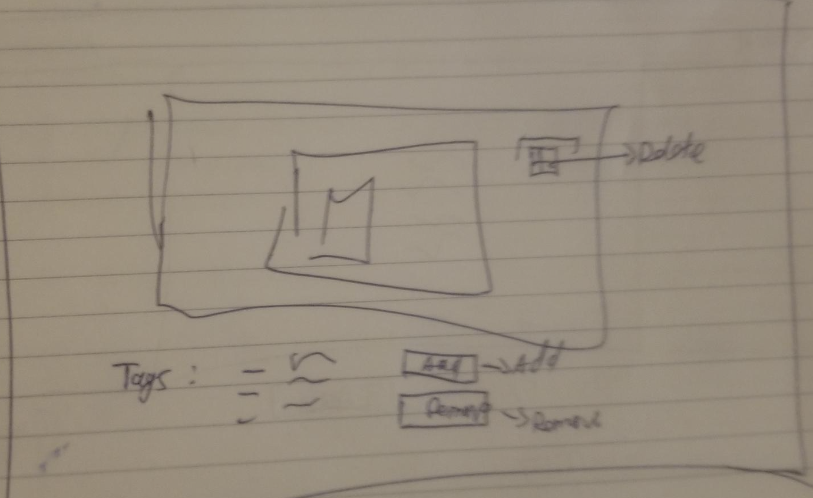
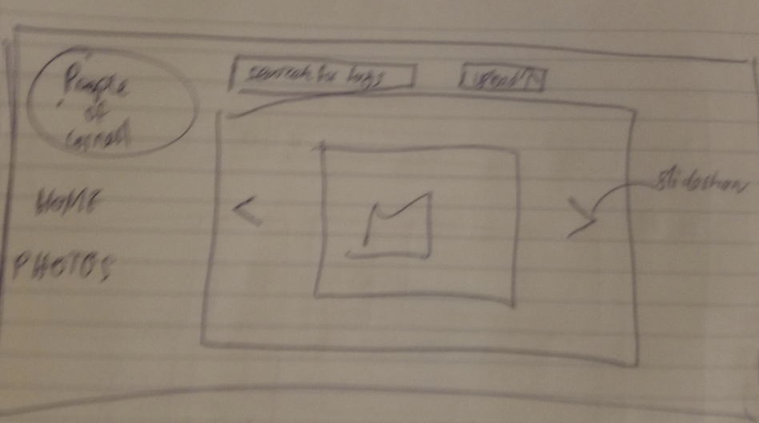
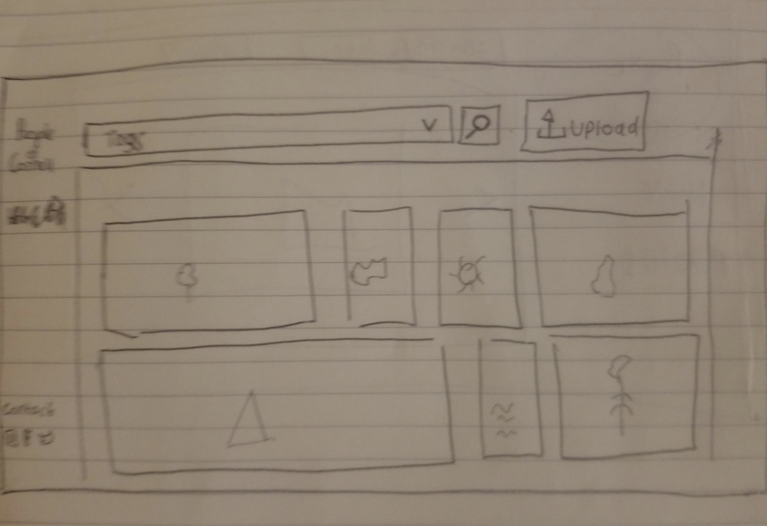
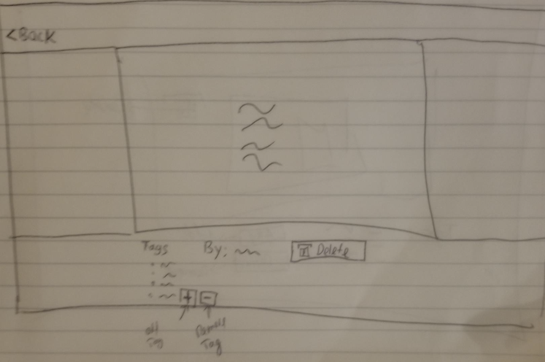

# Project 3: Design Journey

Be clear and concise in your writing. Bullets points are encouraged.

**Everything, including images, must be visible in VS Code's Markdown Preview.** If it's not visible in Markdown Preview, then we won't grade it.

# Design & Plan (Milestone 1)

## Describe your Gallery (Milestone 1)
> What will your gallery be about? 1 sentence.

My gallery will be about the people of Cornell and it's diverse, beautiful culture.

> Will you be using your existing Project 1 or Project 2 site for this project? If yes, which project?

No

> If using your existing Project 1 or Project 2, please upload sketches of your final design here.


## Target Audience(s) (Milestone 1)
> Tell us about your target audience(s).

My target audience is the people that are have been or are currently on the Cornell Campus. They have spent some time in Cornell and have grown to love the place and its people. They are eager to see other people's experiences as well as share thier own.

## Design Process (Milestone 1)
> Document your design process. Show us the evolution of your design from your first idea (sketch) to design you wish to implement (sketch). Show us the process you used to organize content and plan the navigation (card sorting), if applicable.
> Label all images. All labels must be visible in VS Code's Markdown Preview.
> Clearly label the final design.

Design 1

My first page of the draft. In this case, I wanted the first page to be a slideshow with the image taking up most of the space.
I would have a nav bar on the side. I will also have a search bar to search for tags and an upload button to upload images.


This second page is the details page that would show up when an image is clicked. It shows the tags of tht pic as well as options to add or remove them


For my final design, I decided not to keep the slideshow as many website don't do that these days. We want our users to see the many pictures in one go. So i decided to have a timeline of images.


The details page is kinda similar but I changed the add/remove buttons to symbols since that's how most sites are. I also added a back button to return to the home page.


Design 2

## Design Patterns (Milestone 1)
> Explain how your site leverages existing design patterns for image galleries.
> Identify the parts of your design that leverage existing design patterns and justify their usage.
> Most of your site should leverage existing patterns. If not, fully explain why your design is a special case (you need to have a very good reason here to receive full credit).

Upload
    - The upload button has a universal "upload" symboal and it changes colors when hovered over.
Delete/Remove
    - A three dot menu button that will show an option to delete
Logo as Home Button
    - The logo has a link to the home page
Hover on pictures
    - Pictures when hovered over will show buttons to click to view image closer in detail.
Plus/Minus signs
    - To add tags and remove them, users will have to click on a plus and minus sign, respectively.

## Requests (Milestone 1)
> Identify and plan each request you will support in your design.
> List each request that you will need (e.g. view image details, view gallery, etc.)
> For each request, specify the request type (GET or POST), how you will initiate the request: (form or query string param URL), and the HTTP parameters necessary for the request.

Example:
- Request: view movie details
  - Type: GET
  - Params: id _or_ movie_id (movies.id in DB)

- View image details
    - Type: GET
    - Params: id(in images in DB)
- Upload picture
    - Type: POST
    - Params : Query string (INSERT)
- Select Tag
    - Type: GET
    - Params: id(in tags in DB) and image_id and tag_id
- Add tag
    - Type : POST
    - Params : Form, id(tags)
- Remove tag
    - Type : POST
    - Params: tag_id
- Delete picture
    - Type : POST
    - Params : Query string, image_id, id(images)

## Database Schema Design (Milestone 1)
> Plan the structure of your database. You may use words or a picture.
> Make sure you include constraints for each field.

> Hint: You probably need `images`, `tags`, and `image_tags` tables.

> Hint: For foreign keys, use the singular name of the table + _id. For example: `image_id` and `tag_id` for the `image_tags` table.


Example:
```
movies (
id : INTEGER {PK, U, Not, AI}
field2 : ...
...
)
```


images (
id : INTEGER {NOT NULL PRIMARY KEY AUTOINCREMENT UNIQUE}
file_ext : TEXT
description : TEXT
)

tags ( id
 INTEGER {NOT NULL PRIMARY KEY AUTOINCREMENT UNIQUE}
 tag TEXT {UNIQUE}
 )

image_tags (
id: INTEGER {NOT NULL PRIMARY KEY AUTOINCREMENT UNIQUE}
image_id: INTEGER
tag_id:{INTEGER
)


## Database Query Plan (Milestone 1)
> Plan your database queries. You may use natural language, pseudocode, or SQL.
> Using your request plan above, plan all of the queries you need.

1) SELECT * FROM tags

2) INSERT INTO images ( id, file_ext, description) VALUES (  );

3) INSERT INTO image_tags ( id, image_id, tag_id) VALUES (  );

4) SELECT images.id FROM images WHERE images.id =;

5) DELETE FROM images WHERE images.id =;

6) DELETE FROM tags WHERE tags.id =;

7) SELECT images.id, images.file_ext, tags.tag FROM image_tags INNER JOIN tags ON image_tags.tag_id = tag.id;


## Code Planning (Milestone 1)
> Plan what top level PHP pages you'll need.

- Autopopulate images on screen
        When user opens home page{
            SQL Query to fetch all seed data of pictures
            Loop through all records as it displays pictures in columns and rows
        }

> Plan what partials you'll need.
None at the moment

> Plan any PHP code you'll need.
- Autopopulate dropdown menu
        fetch all tags from database(SQL Query)
        For every tag in database{
            Echo each tag as an option on homepage
        }
- Add tag
        If addTag form is submitted:
            Take input and add Tag to database (SQL Query)
            Add new tag to list of options on homepage
        }
- Remove tag{
    if removeTag form is submitted:
        Take input and remove tag from databaseS
}

- Photo details
        When user clicks on image{
            Recieve input on which image to display
            Fetch that image from database
            Display
        }
- Plus sign
        When user clicks on + symbol :
            change display : none off in css to show addTag form

- Minus sign
    When user clicks on - symbol :
            change display : none off in css to show removeTag form

- Menu icon
    When user clicks on delete symbol:
        delete image and associated tags from database
Example:
```
Put all code in between the sets of backticks: ``` code here ```
```


# Complete & Polished Website (Final Submission)

## Gallery Step-by-Step Instructions (Final Submission)
> Write step-by-step instructions for the graders.
> For each set of instructions, assume the grader is starting from index.php.

Viewing all images in your gallery:
1. On the home page
2. Select "All pictures" from options
3. Press submit

View all images for a tag:
1. Select tag from options
2. Press submit

View a single image and all the tags for that image:
1. Hover over image
2. Click image
3. Tags will be available

How to upload a new image:
1. Click camera icon on front page
2. Write description
3. Hit upload button

How to delete an image:
1.
2.

How to view all tags at once:
1. All tags are available in the options on homepage
2.

How to add a tag to an existing image:
1. Click image
2. Go to Add image form
3. Type in new tag
4. Hit "PLus" Button

How to remove a tag from an existing image:
1. Click image
2. Go to remove form
3. Select tag to be removed
4. Hit "minus" button


## Reflection (Final Submission)
> Take this time to reflect on what you learned during this assignment. How have you improved since starting this class?

I feel like I have come so far since I started this class. I always heard about databases, but I had no idea what they were or how they work. Now, however, I can work with databases as well as understand their importance in web development as they boost our capabilities. Additionaly, at the end of 1300, I couldn't wait till I learned about back-end development so that I can build my own fully funcitoning website. Now I am confident to build websites and it feels really good.
